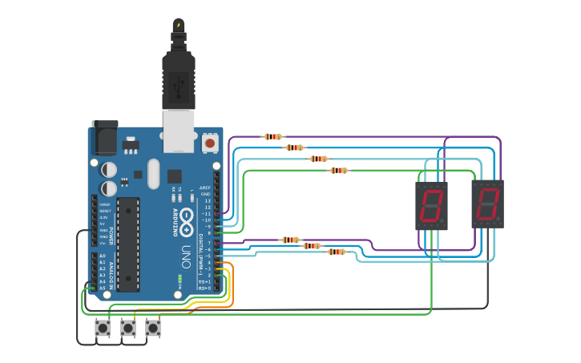
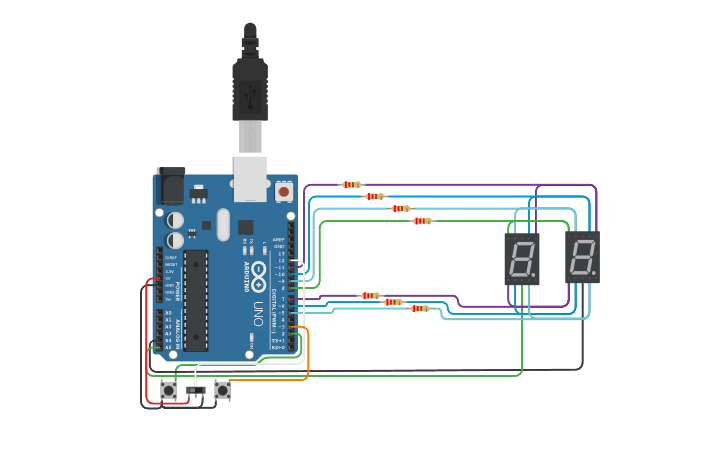
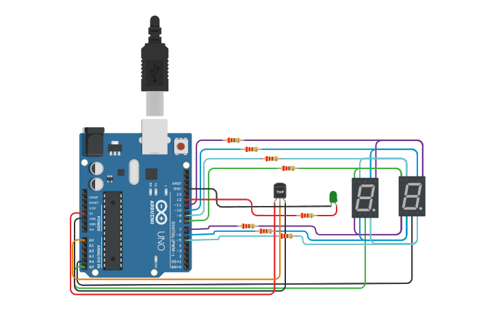
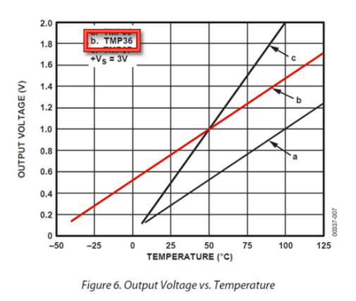
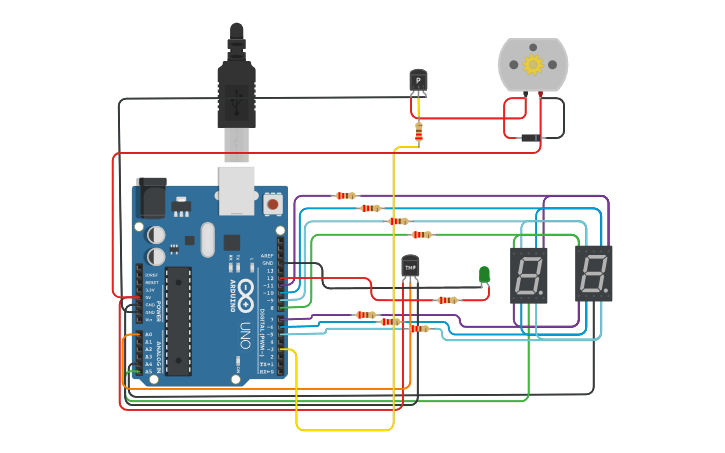

# Arduino Multiplexación

## Integrantes 
- Maximiliano A. Rivera Mendes
- Hernan Robbiano
- Irina Rivas Ramirez

## Proyecto: Display 7 Segmentos y Multiplexación (PARTE 1).

## Descripción
Diseña un contador de 0 a 99 utilizando dos displays de 7 segmentos y tres botones para
controlar la cuenta. Estos botones, incrementan, decrementan o resetean el contador.

## Función principal
**FUNCION:** ___Esta funcion se encarga de enceder los LEDs de un display.___\
**USO:** ___Recorre una lista de Display de 7 segmentos en Multiplexación y por un delay, transiciona de una en otra.___\
**VARIABLES:** ___number de tipo entero, es el valor que va a imprimir en los displays.___\
**RETORNA:** ___None___

~~~ C
void showNumber(int number) {
   int digits[2] = {number / 10, number % 10};
   
   for (int i = 0; i < 2; i++) {
     digitalWrite(displayPins[i], HIGH);
     showDigit(digits[i]);
     delay(50);
     digitalWrite(displayPins[i], LOW);
   }
}
~~~

## :robot: Link al proyecto
- [Proyecto: Tinkercad Parte 1](https://www.tinkercad.com/things/6XI9OxBgVjY)

## Proyecto: Switchs y botones (PARTE 2).

## Descripción
Diseña un contador de 0 a 99 utilizando dos displays de 7 segmentos, 2  botones y 1 switch para
controlar la cuenta o mismo, cambiar para contar con numeros primos.
Estos botones, incrementan, o resetean el contador.

## Función principal
**FUNCION:** ___Esta funcion se encarga de enceder los LEDs de un display.___\
**USO:** ___Recorre una lista de Display de 7 segmentos en Multiplexación y por un delay, transiciona de una en otra.___\
**VARIABLES:** ___number de tipo entero, es el valor que va a imprimir en los displays.___\
**RETORNA:** ___None___

~~~ C
void showNumber(int number) {
  // Recorre una lista de 7 segmentos en Multiplexacion y por un delay.
  int digits[2] = {number / 10, number % 10};
  for (int i = 0; i < 2; i++) {
    digitalWrite(displayPins[i], HIGH);
    showDigit(digits[i]);
    delay(50);
    digitalWrite(displayPins[i], LOW);
  }
}
~~~

## :robot: Link al proyecto
- [Proyecto: Tinkercad Parte 2](https://www.tinkercad.com/things/iZndEi24wGq)

## Proyecto: Sensor de temperatura (PARTE 3).

## Descripción
Diseña un contador de 0 a 99 utilizando dos displays de 7 segmentos con 1 sensor TMP36 para saber la temperatura ambiente.

## Sensor TMP36
**CONFIGURACION DE PINES:** ___Conectar el pin izquierdo a una entrada de (2.7-5.5V), el pin del medio a un analogico(ADC) pueden ser en un rango A0~A5 en el arduino UNO (R3) y el ultimo pin a Ground.___\
**APLICACIONES:**

- Systema de control ambiental
- Proteccion de temperatura
- Control en el proceso industrial 
- Alarma para incendios
- Monitoreo de sistemas
- Control de temperaturas en procesadores

**FORMULA:** 
~~~ C
//Voltaje en el pin representado en mV = (ADC) * (5000/1024)
//Esta formula convierte el numero entre 0~1023 del ADC en 0-5000mV = 5V
int calcularCentigrados() {
  // en un rango de 0V a 5V en un pin Analogico(ADC), tiene de 0~1023 posibles valores
  int sensor_valor = analogRead(sensorsPins[0]);
  // obtengo la potencia
  //float potencia = 5.0 / 1024 * sensor_valor; 
  // obtengo la temperatura final aproximada
  //float temperatura = potencia * 100 - 50;
  float temperatura = map(sensor_valor, 20, 358, -40, 125);
  return(temperatura);
}
~~~

## Función principal
**FUNCION:** ___Esta funcion se encarga de mostrar la temperatura ambiente, en displays de 7 segmentos y en un led que adicional que marca las temperaturas bajo cero.___\
**USO:** ___Recorre una lista de Display de 7 segmentos en Multiplexación y por un delay, transiciona de una en otra.___\
**VARIABLES:** ___number de tipo entero, es el valor que va a imprimir en los displays.___\
**RETORNA:** ___None___

~~~ C
void showNumber(int number) {
  // Recorre una lista de 7 segmentos en Multiplexacion y por un delay.
  if(bajoZero(number) == true){
    number *= -1;
    digitalWrite(ledPins[0], HIGH);
  }
  else {digitalWrite(ledPins[0], LOW);}
  if(number > 99){number = 99;}
  int digits[2] = {number / 10, number % 10};
  for (int i = 0; i < 2; i++) {
    digitalWrite(displayPins[i], HIGH);
    showDigit(digits[i]);
    delay(50);
    digitalWrite(displayPins[i], LOW);
  }
}
~~~

## :robot: Link al proyecto
- [Proyecto: Tinkercad Parte 3](https://www.tinkercad.com/things/fkK2GnB0yXb)

## Proyecto: Sensor de temperatura (PARTE 3).

## Descripción
Diseña un contador de 0 a 99 utilizando dos displays de 7 segmentos con 1 sensor TMP36 para saber la temperatura ambiente y encender un motor DC para enfriar el recurso (con un ventilador).

**FORMULA:** 
~~~ C
//Voltaje en el pin representado en mV = (ADC) * (5000/1024)
//Esta formula convierte el numero entre 0~1023 del ADC en 0-5000mV = 5V
int calcularCentigrados() {
  // en un rango de 0V a 5V en un pin Analogico(ADC), tiene de 0~1023 posibles valores
  int sensor_valor = analogRead(sensorsPins[0]);
  // obtengo la potencia
  //float potencia = 5.0 / 1024 * sensor_valor; 
  // obtengo la temperatura final aproximada
  //float temperatura = potencia * 100 - 50;
  float temperatura = map(sensor_valor, 20, 358, -40, 125);
  return(temperatura);
}
~~~

**CONECCIONES:** ___El motor va conectado al Transistor (PNP), el cual tiene 3 pines:___
- Emisor: ___Terminal_1 del motor DC___
- Base: ___PIN3 PWM-  Pulsle Width Modulation, tecnica que nos permite tener resultados analogicos sobre entradas digitales.___
- Colector: ___Ground.___

**FUNCION:** ___La funcion _motorControl(temperatura)_ provoca el encendido del motor DC en un rango de 600rpm~=15 <= 1800rpm >= 60 = 8000rpm.___

~~~ C
void motorControl(float temperatura) {
  if (temperatura >= 60) {
    analogWrite(motorPins[0], -500);
  }
  else if (temperatura <= 15){
    analogWrite(motorPins[0], -20);
  }
  else {
    analogWrite(motorPins[0], 200);
  }
}
~~~

## :robot: Link al proyecto
- [Proyecto: Tinkercad Parte 3](https://www.tinkercad.com/things/fkK2GnB0yXb)